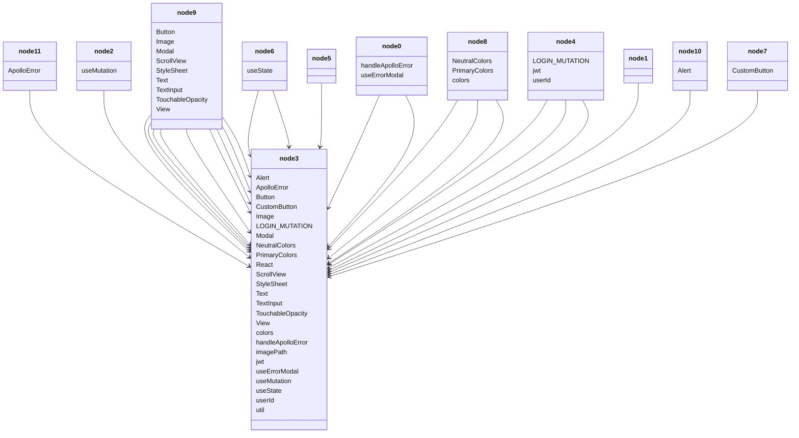

```mermaid
classDiagram
direction TB
class node11 {
    ApolloError
}
class node2 {
    useMutation
}
class node6 {
    useState
}
class node9 {
    Button
    Image
    Modal
    ScrollView
    StyleSheet
    Text
    TextInput
    TouchableOpacity
    View
}
class node5
class node0 {
    handleApolloError
    useErrorModal
}
class node8 {
    NeutralColors
    PrimaryColors
    colors
}
class node4 {
    LOGIN_MUTATION
    jwt
    userId
}
class node1
class node10 {
    Alert
}
class node3 {
    Alert
    ApolloError
    Button
    CustomButton
    Image
    LOGIN_MUTATION
    Modal
    NeutralColors
    PrimaryColors
    React
    ScrollView
    StyleSheet
    Text
    TextInput
    TouchableOpacity
    View
    colors
    handleApolloError
    imagePath
    jwt
    useErrorModal
    useMutation
    useState
    userId
    util
}
class node7 {
    CustomButton
}

node11  -->  node3 
node2  -->  node3 
node9  -->  node3 
node9  -->  node3 
node9  -->  node3 
node9  -->  node3 
node9  -->  node3 
node6  -->  node3 
node9  -->  node3 
node9  -->  node3 
node6  -->  node3 
node9  -->  node3 
node9  -->  node3 
node5  -->  node3 
node0  -->  node3 
node0  -->  node3 
node8  -->  node3 
node8  -->  node3 
node8  -->  node3 
node4  -->  node3 
node4  -->  node3 
node4  -->  node3 
node1  -->  node3 
node10  -->  node3 
node7  -->  node3 

```
